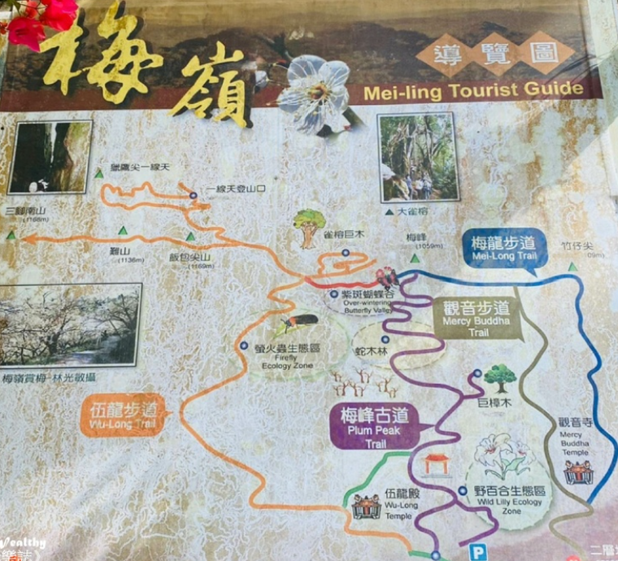

## 住宿
- 木村家園  台南市東山區高原里高原98號(鄰近關子嶺溫泉)
  - 平日  $ 1500  | 假日  $ 1800  | 定價  $ 3000  ■ 平日：週日~週五  ■ 假　日：週六、教師節、光復節、行憲紀念日、連續假期  ■ 定　價：農曆年節
  - 「木村莊園」~ 鄰近關子嶺溫泉，是您台南住宿的最佳選擇 ~「木村莊園」 平價與高品質的享受，設備齊全，地理環境優， 鄰近關子嶺溫泉，至大仙寺、碧雲寺、水火同源、大凍山步道、天池、曾文水庫風景區，交通非常便利，是台南遊玩的住宿首選。
- 五隆園咖啡B&B景觀莊園  電話：06 686 3597
  - 地址：733台南市東山區高原里李子園108之4號
  - 營業時間：早上10:00-晚上21:00

## 台南瀑布
- 台南南化關山里「千層岩瀑布」
- 楠西蝙蝠洞瀑布
  - 近南118茄拔路，距離梅嶺風景區僅10分鐘的車程，自停車場步行約200公尺的森林步道，只需5分鐘即可抵達這別有洞天的秘境 . 
- 台南秘境▍阿拉溪斜瀑布群
- 『九重溪瀑布』台南秘境｜白河唯一的瀑布｜10分鐘就能抵達的瀑布｜

## 台南登山步道
- 8條台南登山步道推薦 https://www.welcometw.com/%E5%8F%B0%E5%8D%97%E7%99%BB%E5%B1%B1%E6%AD%A5%E9%81%93/
- 台南登高推薦-二寮觀日亭
- 台南登山步道｜#1 獵鷹尖一線天步道
- 台南登山步道｜#2 崁頭山步道
- 台南登山步道｜#3 碧雲火泉步道
- 台南登山步道｜#4 梅嶺伍龍步道
- 台南登山步道｜#5 南化龍麟山登山步道
- 台南登山步道｜#6 小南海自然生態公園環湖步道
- 台南登山步道｜#7 龍崎虎形山公園步道
- 台南登山步道｜#8 關子嶺大凍山步道
#### 新化
- 新化| 中興林場 | 觀音山、尖山  5.3公里 2 小時
  - 礁坑仔山(糞枝湖山、畚箕湖山)/101m/三等三角點/編號：607
  - 中興大學新化林場步道群
  - 步道乾淨,維護的不錯,建議做好防蚊,順便收下礁坑仔山基石~
  - 中興大學實驗林場，休閒、遊旅、聚餐都很適合，新南瀛勝景～八景十勝之一。
  - 日治時期設立的臺南演習林，後曾名為新化林場、新化國家植物園，是鹽水溪水系及虎源溪之發源地，亦是虎頭埤水庫的集水區。
  - 園內有豐富的植物生態，設有挹翠步道、林場步道、環湖步道、擷秀步道、大目降林道、蝴蝶薑步道、胭脂坡林道、相楝步道、森情小徑等，步道四通八達。
  - 循著高低起伏的木棧道，穿梭在樹齡逾50年的桃花心木林群之中，樹木茂密處處林蔭，充滿芬多精的一處森林，是全臺唯一一座低海拔的熱帶林場，曾獲得「新南瀛勝景」八景十勝之一，沿途欣賞生態池、夫妻樹、百年橄欖樹等，並有餐廳、農特產中心等設施
  - 每年4月螢火蟲季時，園區會舉辦賞螢活動，適合觀察自然生態、研習、運動健行等活動。

#### 梅嶺
- 台南登山步道｜#4 梅嶺伍龍步道
- 竹子尖山步道   4公里 2 小時
  - https://hiking.biji.co/index.php?q=trail&act=detail&id=816
  - 觀音步道邊坡多處土石崩落，步道受阻無法通行，自即日起暫停開放，後續開放時間是步道修復狀況另行公告。
  - 竹子尖山座落在梅嶺風景區上方，為台南市第二高峰，登頂途中可俯瞰大凍山脈、嘉南平原、曾文水庫和南化水庫，天氣晴朗時甚至能遠眺玉山群峰，還有機會欣賞日出、雲海、夕陽和夜景，可說是一座四季皆宜、雅俗共賞的台灣小百岳。
  - 梅嶺的二層坪停車場出發，主要有四條步道可前往竹子尖山，由北至南分別是：梅峰、伍龍、觀音和梅龍步道，最後都會經由稜線步道抵達竹子尖山
  - 山頂的氣象局雨量測報站是最醒目的地標
  - 建議上下山時選擇不同的步道，走一圈環狀路線，沿途瀏覽不一樣的景致
  - 尤其是隆冬梅花盛開時和四五月間的螢火蟲季，登高望遠和賞花賞螢的民眾更是絡繹不絕！踏青之餘，不妨順道品嘗梅子雞大餐、泡龜丹溫泉，無需一番寒徹骨，即可享受撲鼻的梅花香和梅嶺好風光！

- 台南觀音步道
- 六甲|烏山嶺水利古道
  - 114.06.22台南／六甲烏山嶺水利古道(東西口縱走)跟著八田與一的腳步見證歷史古道之旅〔竹高崙山3連峰〕
- 白河|六溪香路古道  3.8公里  1 小時 10 分鐘 
  - https://hiking.biji.co/index.php?q=trail&act=detail&id=756
  - 本處已於110年12月邀請當地社區代表及專家學者現勘審議，達成共識決議廢止該步道。
  - 六溪香路古道位於台南白河的六溪社區到碧雲寺之間，是當地人為了迎送佛祖而走出的進香之路
  - 2014年整修完成之後，成為一條兼具歷史、宗教、生態與觀光價值的健行步道
  - 遊客可選擇從碧雲寺或六溪社區兩端進出，古道沿溪畔而行，起伏和緩、落葉鋪地、綠樹成蔭，沿路設有指標、里程樁、觀景台和十座木橋，途中還有兩段以「攀岩工法」建造的木椿陡坡，需雙手拉繩、兩腳踏樁而過，可體驗一下如野訓場般的攀爬樂趣！
  - 走完古道，不妨前往兩百多年的碧雲寺享用素齋和觀賞三級古蹟的建築雕刻、欣賞碧雲公園的巨榕、石洞和嘉南平原的晚霞夕照。
  - 或是在另一端的六溪社區中尋訪平埔族的公廨、石碑和古井，也可順遊關子嶺、枕頭山或水火同源等景點，在蓮花之鄉充份感受多元文化與溫泉的洗禮。
  - 碧雲寺開始算的2.2k~2.3k(即快到接近六溪端出口)，有一二段階梯損壞，地基流失坍方的很嚴重，勉強可過(以有在健行登山的人來說)
- 北門|大湖山自然步道
- 新化|觀音山步道==>是一條長達4公里的登山步
- 新營|崁頂山步道
- 南化|獵鷹尖一線天步道 ==>  梅峰古道   伍龍步道
  - https://hiking.biji.co/index.php?q=trail&act=detail&id=784
  - 2025.3.19更新 依然未通  回程鐵橋坍方 要原路來回  往什麼雀龍巨木的沒有路啦，到獵鷹尖另外一邊下不了山，要原路返回
  - 梅嶺地區除了盛產梅子外，也是著名的賞螢聖地，每逢春夏之交，入夜後整座山都是滿滿的螢火蟲！波卡四月中造訪已滿山螢火閃爍。
  - 2個大方向的停車地點，一個是梅峰古道登山口，另一個是飯包山福德祠
  - https://travel.yam.com/article/129987
  - 「獵鷹尖一線天」登山步道，要先經伍龍步道或梅峰古道才能抵達，不少人會選擇O字型的路線，由梅峰登山口上山、伍龍步道下山，大約4~5小時
  - 當天我們選擇來回都走伍龍步道，從伍龍殿開始起登約3個半小時。
  - https://impoca.com/meiling/
  - 梅峰古道登山口 ==> 715台南市楠西區32號 （大眾餐廳旁）
  - 【步行時間】停車在梅峰古道登山口到獵鷹尖單程約2.5小時
  - 沿路多為好走的步道，但往一線天獵鷹尖前會需要攀繩，且繩上螞蟻多，建議戴手套。 路線蚊蟲多，建議防蚊防蟲做好。
  - 一線天步道較狹窄，建議依照路線指示走O型。再往前走會看到回程下山的指標，記得下山不要走原路，走O型下山比較安全喔。
  - 每年春夏之交4-6月為螢火蟲季，可安排健行＋吃梅子雞＋賞螢 的一日遊。
  - 伍龍步道為主要賞螢區，若是為了賞螢，走伍龍步道即可。伍龍步道的出水坑為熱門賞螢點。(從伍龍步道入口往上走，腳程80 分鐘，路程約2 公里。)
  - 伍龍步道沿路都是好走的水泥路下坡，但坡度其實也頗陡，膝蓋不好的朋友建議戴護膝。伍龍步道在4-6月是知名的賞螢區。
  - 約12-1 月時梅花盛開，觀音寺、伍龍殿、二層坪、福來百年老梅園為梅樹較多的區域。

- 南化|鈺鼎步道
  - https://hiking.biji.co/index.php?q=review&act=info&review_id=20715
  - 嘉義分署：受低壓豪大雨影響，步道多處路段崩塌，自114年8月6日起至12月31日暫停開放
  - 8:35從登山口出發，9:25到達山頂涼亭。  單程1.6公里   ==> 2 小時 20 分鐘(往返)
  - Google 導航直接搜尋鈺鼎步道即可，停車場很大不用怕沒車位，天豔宮右邊有公廁，左邊是登山口
  - 走到叉路處，左邊階梯是鈺鼎步道，右邊土徑是往水山頂山。
  - 後半段連續陡上的階梯真的蠻累人的
  - 鈺鼎步道位於台南市南化區北寮里，由天豔宮起登，步道全長1.6公里，前段是平緩的土徑，後段有石階和木棧道鋪成的1,470個階梯，並不算太難，堅持一下就走到頂了
  - 沿途林木翠綠，環境清幽，保有原始自然生態，月橘、光臘樹、木棉，柚木等高大造林樹種呈線狀分佈，其中以原生百年的月橘老樹最為珍貴，是其特色。
  - 山頂有兩處大石並立，猶如兩隻青色石龍盤踞，一旁設有休憩平台，故稱為「雙龍休憩點」，在此可眺望南化水庫湖光山色、南化的牛稠仔及坑內谷地、南化淨水廠、月世界、牛湖山、烏山稜脈等，美麗山川景緻一覽無遺
- 南化|紫霞登山口
- 南化|玉井溪步道==>是一條長達8公里的溪流步道
  - 2025玉井景點一日遊  https://fullfen.tw/yujing/
  - https://travel.ettoday.net/article/2200319.htm 
- 後壁|八掌溪步道，全長約8公里，沿途有許多瀑布和溪流
  
