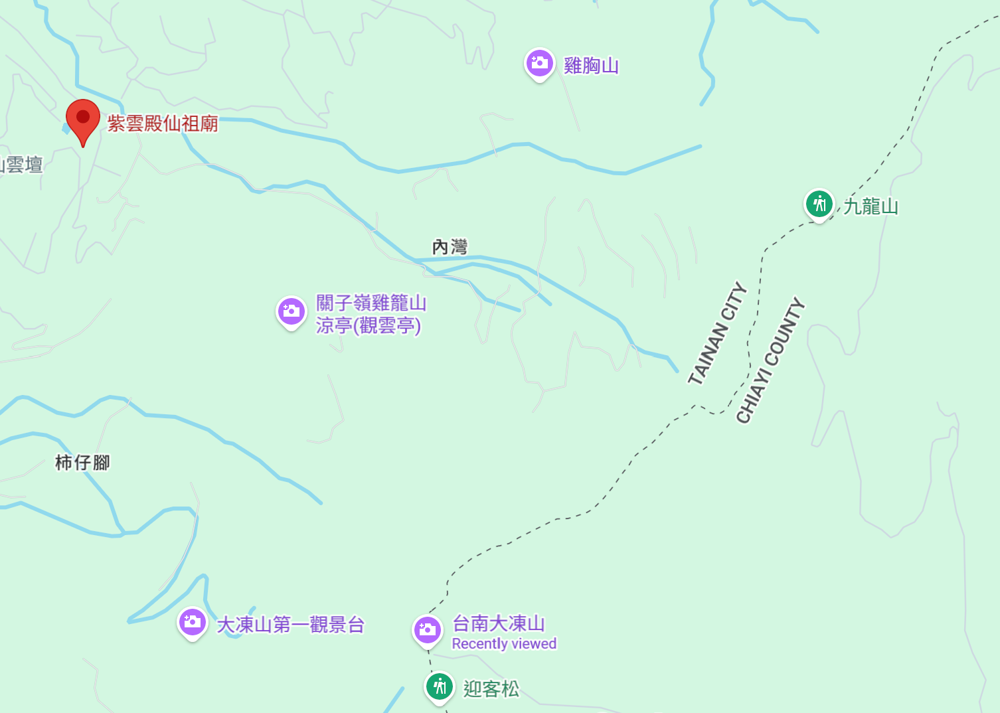
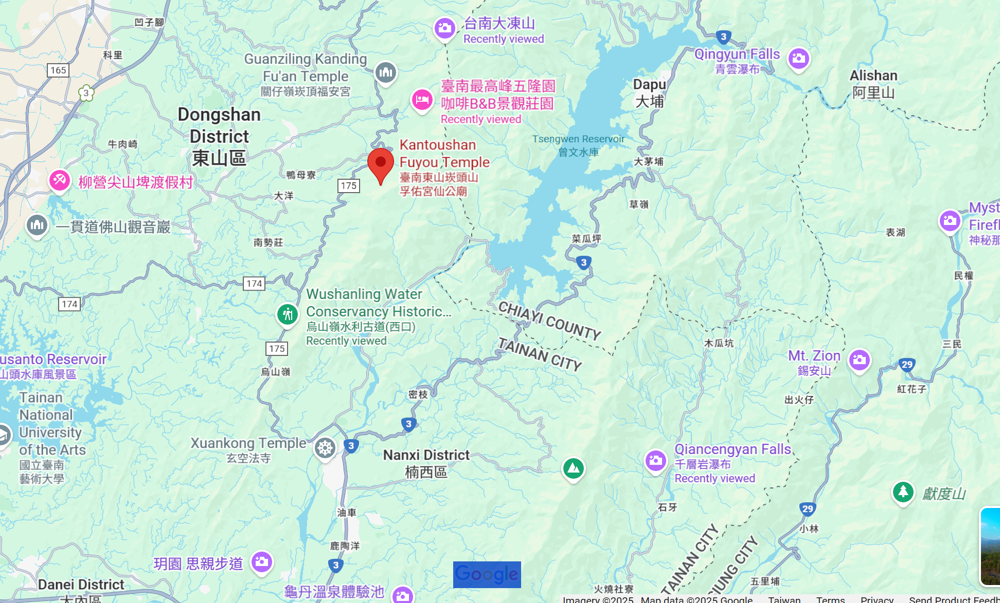
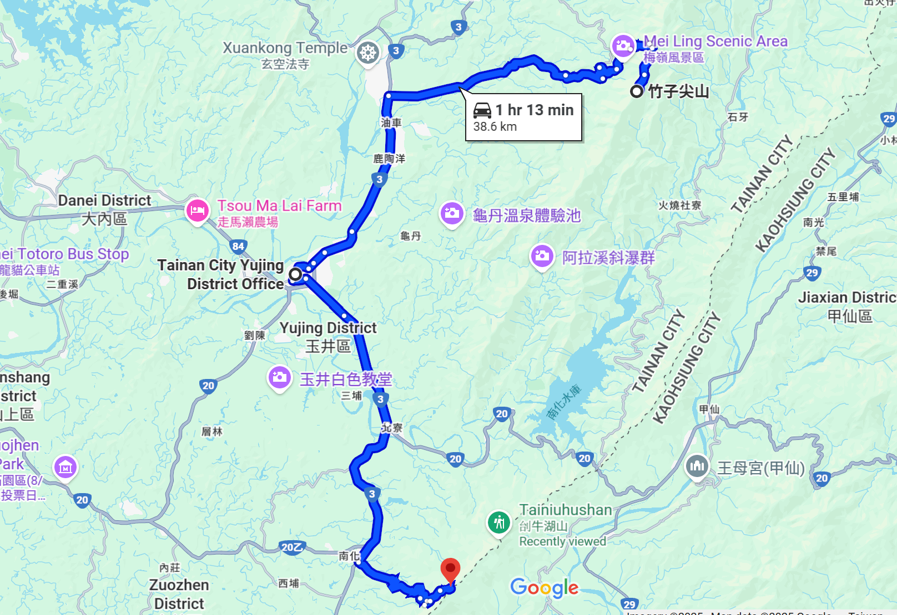
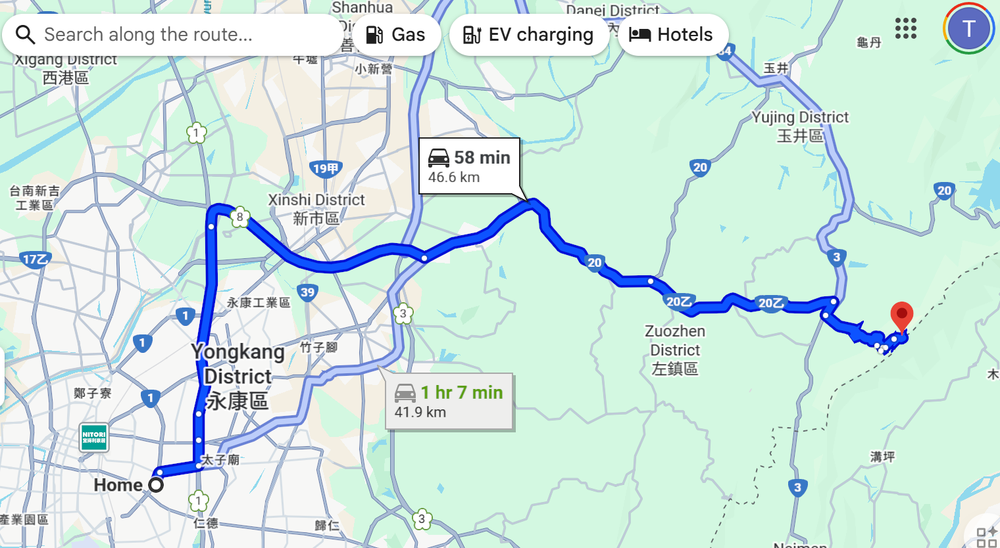

## 台南4座「小百岳」特輯 輝哥的天空
- 台南小百岳｜白河區大凍山
  - 紫雲殿仙祖廟
  - 關子嶺雞籠山
  - 九龍山
  - 2024-036：雞九凍縱走（雞籠山、九龍山、大凍山）
    - https://hiking.biji.co/index.php?q=review&act=info&review_id=34186 
  - 枕頭山步道
    - 枕頭山的登山口，我覺得最方便的就是從碧雲寺後方的「碧雲火泉步道」
    - https://hiking.biji.co/index.php?q=review&act=info&review_id=15041

#### 關子嶺
- 木村家園  台南市東山區高原里高原98號(鄰近關子嶺溫泉)
  - 平日  $ 1500  | 假日  $ 1800  | 定價  $ 3000  ■ 平日：週日~週五  ■ 假　日：週六、教師節、光復節、行憲紀念日、連續假期  ■ 定　價：農曆年節
  - 「木村莊園」~ 鄰近關子嶺溫泉，是您台南住宿的最佳選擇 ~「木村莊園」 平價與高品質的享受，設備齊全，地理環境優
  - 鄰近關子嶺溫泉，至大仙寺、碧雲寺、水火同源、大凍山步道、天池、曾文水庫風景區，交通非常便利，是台南遊玩的住宿首選。
- 五隆園咖啡B&B景觀莊園  電話：06 686 3597  ==> 台南夜景
  - 地址：733台南市東山區高原里李子園108之4號
  - 營業時間：早上10:00-晚上21:00
  - 25分 ==> 紫雲殿仙祖廟 732, Tainan City, Baihe District, 99-3
  - 20分 ==> 台南小百岳｜東山區崁頭山
  - 30分 ==> 烏山嶺水利古道(西口)

#### 台南小百岳｜東山區崁頭山
  - 海拔高度：約844公尺
  - 路徑長度：約3.5公里
  - 步行時間：約1.5小時
  - 難度：低-中
  - 小百岳編號：64
  - 基點：崁頭山/844m/三等三角點/編號0123
  - 崁頭山登山步道全長約2.5公里，繞行一圈 約2小時
  - 登山起點位於孚佑宮仙公廟，大家如果要開車前往可以直接Google定位孚佑宮。
  - 走國道三號北上方向，下烏山頭出口後會經過174縣道後再接175縣道就會抵達孚佑宮仙公廟。
  - 崁頭山登山步道路線其實不難走，也不容易迷路，一路階梯向上。登頂前約20分鐘會遇到分叉路，建議先往左繼續走階梯上去。
  - 山頂涼亭旁有個情人石，這顆大石頭除了可以讓你看到整個嘉南平原外
  - 西口小瑞士 >> 174翼騎士驛站 >> 崁頭山登山步道 >> 關子嶺溫泉
  - 烏山嶺水利古道(西口) ==> 從玉井來30分鐘 | 從臺南最高峰五隆園咖啡B&B景觀莊園來30分鐘
    - https://travel.yam.com/article/128098
    - 台南市的烏山嶺東西口越嶺步道，全長4.2公里，
    - 不僅是嘉南大圳之父八田與一在興建烏山頭水庫時經常往返探勘的路線
    - 登山口：西口登山口在175道路23K，座標23.223155, 120.470001。東口登山口在曾文水庫內
    - 里程：主線(不含轉往竹高崙山)單程4.2K，落差約425M，原路來回，總爬升730M，需時約3.5~4.5小時

## 玉井住宿
- https://www.booking.com/searchresults.zh-tw.html?aid=357028&label=bin859jc-10CAMYhwQo5wFCBnl1amluZ0gwWANo5wGIAQGYATO4ARfIAQzYAQPoAQH4AQGIAgGoAgG4AouqosUGwAIB0gIkZTg0ZTMwZWQtOTAwOS00MjAzLWI1NzgtMDZjZTI1ODdjMWQ22AIB4AIB&highlighted_hotels=8372826&nflt=sth%253D28&city=900054438
- 玉井拱月民宿 1600     0972-026029  06-5741666,0972026029
  - 臺南市玉井區玉田里23鄰大成路97號
- 漾,大埔鄉  1280
  - 位於玉井區運動公園旁，停車方便。鄰近玉井夜市及圖書館 
- 玉井虎頭山位在玉井竹圍里境，因山勢酷似虎頭而得名，山標高239公尺。
- 是玉井區域內非常有名的咖啡賞景勝地，山頂的幾間咖啡館每到假日總是一位難求，
- 每家咖啡館都各有特色，所擁有的景觀條件也都不相同，各個角度都有不同的美，
- 但唯一相同的是都位於玉井市區的至高處，白天可以眺望山中小鎮的景致，夜晚則是可以欣賞玉井的精緻夜景，是許多年輕族群喜愛的浪漫約會處。
- 龜丹溫泉體驗池

#### 台南小百岳｜楠西區竹子尖山
  - 想要登山竹子尖山，主要有四條路徑可以選擇：梅峰、伍龍、觀音和梅龍步道
  - 每個步道都各有特色、路況多元，建議旅人可以交互規劃路線，走不同的路徑上下山，欣賞竹子尖山的不同面貌。
  - 海拔高度：約1110公尺  路徑長度：約4公里  步行時間：約2小時  難度：低
  - 小百岳編號：67
  - 基點：二等三角點1090號

#### 台南小百岳｜南化區烏山嶺（刣牛湖山）
  - 烏山、刣牛湖山登山步道」是台灣南部知名的縱走路線，若你只是想要散步踏青，不妨順路撿起烏山嶺這座小百岳
  - 不過，若你想挑戰走完步道全程的話，大約需要八至十小時，可謂小有挑戰呢！
  - 海拔高度：約799公尺  路徑長度：約13公里  步行時間：約8-10小時
  - 難度：低-中   小百岳編號：70
  - 基點：1.風空子山/668m/土地調查局圖根點 2.刣牛湖山/799m/聯勤測量隊內補二等三角點/No：51 3.石松子山/558m/土地調查局圖根點 4.王爺崙山/530m/三等三角點/No：498
  - https://damon624.pixnet.net/blog/post/49515452
  - 開車停在金光山福德祠(點我定位)，大約步行50~60分鐘即可抵達刣牛湖山三角點
  - 沿途可看到北大武山、南大武山、高雄杉林及六龜景緻，步道不難走也很平緩，只有幾處路段雜草稍高，登山杖撥一下即可輕易通過，
  - 三角點可見到南化水庫及淨水廠，來台南想爬步道小百岳就來刣牛湖山吧
  - 從金光山福德祠步行到刣牛湖山三角點，單程約2.4公里，約需60幾分鐘路程，真的不難走喔

