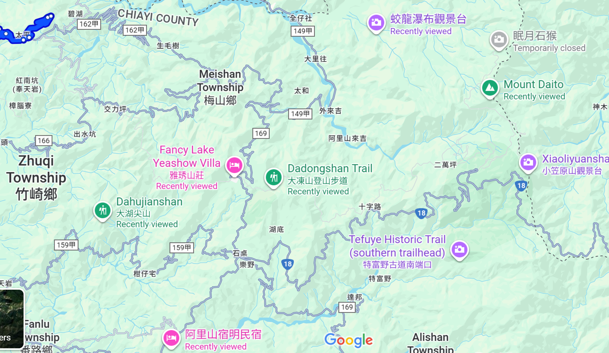

# 嘉義小百岳
- https://travel.yam.com/article/124727
- 台灣山徑分級➤郊山、中級山、高山，小百岳、百岳
- 紅毛埤山
- 獨立山
- 奮起湖大凍山
- 大塔山
- 大湖尖山
- 三腳南山
- 梨子腳山

## 住宿 3
- 太平32彎露營區(車床天地特約)
  - 《太平32彎露營區》
  - 看夕陽、賞夜景、觀雲海、有美麗山景、更有廣大視野，東邊看到中央山脈，前方看到台中地區、雲林古坑地區、梅山鄉及竹崎地區，
  - 向西邊看過去是海天一線的台灣海峽，看得令人心曠神怡，白天享受悠閑，夜間享受寧靜，真是生活的一大享受。
  - 營主阿郎和阿麗夫妻為人善良，待客親切，把車友當家人看待，揪感心！
  - GOOGLE 設太平雲梯為目 的地，一直沿著162甲開到32彎處的叉路口轉進來，再 走900公尺就到了喔** 

## 住宿 1  ==> 竹坑溪步道 + 龍宮瀑布
- 瑞里瑞峰．竹坑民宿  傳真：05-2501891  手機：0928-031995
- 地址：嘉義縣梅山鄉瑞峰村二坪仔3鄰14-1號

## 住宿2
- 阿里山宿明民宿 602, Chiayi County, Fanlu Township, 公田村2鄰潮州湖5號(1:30分)
- 雅琇山莊(1小時46分) 05 256 1336  嘉義縣竹崎鄉中和村奮起湖150號
  - 雅琇山莊距離奮起湖火車站和奮起湖老街有1分鐘的步行路程
  - 以一道紅燒山泉水豆腐，在大阿里山區打出響亮名號的雅琇山莊
  - 最難得的是一道市面上難尋的豬腳筋，這是老闆每天特別到市場上挑選
  - ==> 46 分  蛟龍瀑布位於台灣嘉義縣阿里山鄉豐山村東南方的塔山尾稜岩壁
  - ==> 10  分 奮起湖大凍山
  - ==> 46 分  竹坑溪步道 + 龍宮瀑布
  - 奮起步道  木馬棧道

####  紅毛埤山
- 蘭潭後山步道、紅毛埤山
- 海拔高度：約150公尺
- 路徑長度：約4.5公里
- 步行時間：約1.5小時
- 難度：低
- 小百岳編號：62
####  獨立山
- 獨立山國家步道」是全台唯一沿著鐵路而行的登山步道，並採用「螺旋狀三迴旋」的建築工法，繞獨立山三圈之後方能抵達山頂，是一條相當有特色的步道。
- 獨立山國家步道
- 海拔高度：約816公尺
- 路徑長度：約3.5公里
- 步行時間：約2小時
- 難度：低
- 小百岳編號：58
- 基點：衛星控制點

####  奮起湖大凍山
- 奮起湖大凍山步道
- 海拔高度：約1976公尺
- 路徑長度：約3.8公里
- 步行時間：約2小時
- 難度：低
- 小百岳編號：60
- 基點：無

####  大塔山
- 大塔山位在阿里山森林遊樂區內，不僅是阿里山山脈中的最高峰，也是小百岳中的最高山峰，海拔達2663公尺；高聳的山林、亮麗的自然景色，吸引著許多喜愛登山的了人前往。
- 沿著塔山步道行走，前半段的木棧道平坦，路徑相較簡單、路況良好，走起來涼爽宜人
- 後段後則變成一路陡上，陡升的路徑具有挑戰性、走起來較為艱辛，需要有一定的體力與耐力方能成功登頂
- 最頂端的觀景台後，遠眺群山景致，欣賞360度的全方位視野，山巒疊嶂的雄偉景象令人震懾不已。特別注意：山區午後時常瀰漫霧氣，雖然迷霧增添了山林間的浪漫氣息
- 塔山步道
- 海拔高度：約2663公尺
- 路徑長度：約5.8公里
- 步行時間：5 小時 10 分鐘(往返)
- 難度：低-中
- 小百岳編號：59
- 基點：1.大塔山東南峰/2411m/林補/編號：37

####  大湖尖山
- 大湖尖山是嘉義縣三尖四凍之首，海拔達1357公尺，巍峨的山峰相當顯眼，又有「尖山」之稱。
- 沿著大湖尖山步道慢行，陡峭的石階步道鍛鍊著山友的耐力，有些路徑甚至逼近垂直，雜草叢生的原始山徑增添了登山的挑戰，是鍛鍊腿力、練習登大山的好場所
- 大湖尖山步道
- http://xn--kwr22her7a6qdvs6a.tw/mountain/nopaia/chiayiAA061.htm
  - 從登山口至山頂共計人工打造的石階步道近2000階梯，無緩坡，相當辛苦
- 海拔高度：約1313公尺
- 路徑長度：約3公里
- 步行時間：約3小時
- 難度：低-中
- 小百岳編號：61
- 基點：無
- https://burner75819.pixnet.net/blog/post/575634896
  - 來回2小時含拍照休息 是一座嘉義人可以睡飽再出發的小百岳

####  三腳南山
- 從「跳跳生態農場」附近起登，沿著原始山徑一路向上，有時會遇到巨石、倒木、高大的雜草，沿路充滿挑戰，若對路徑不熟悉的話，不妨跟著登山布條前行、或是先下載好地圖，避免迷失方向。
- 來到後段，一路陡上的山徑都需要攀繩而上，戴起手套、踩穩腳步，一步步慢慢攀登，漫長的攀繩山徑考驗著旅人的臂力，爬完之後手臂可能會酸上好幾天呢！
- 中途的「太師椅」巨石提供旅人短暫的休息處，坐在巨石上歇息一會、遠眺曾文水庫美景
- 三腳南山登山步道
- 海拔高度：約1087公尺
- 路徑長度：約3公里
- 步行時間：約4.5小時（往返）
- 難度：低-中
- 小百岳編號：65
- 基點：1.三腳南山(三角南山)/1186m/二等三角點/編號：1087 2.曾文溪水源保護區界22號水泥椿

####  梨子腳山
- 梨子腳山又被稱作祝壽山，親民的步道、亮麗的景致，吸引著旅人登高望遠、親近大自然。
- 梨子腳山步道僅有1公里，沿著石階步道健行而上，明媚的風光映入眼簾，茶園、竹林、層層山巒，眼見所及綠意盎然、視野開闊
- 海拔高度：約1176公尺
- 路徑長度：約1公里
- 步行時間：約1小時
- 難度：低
- 小百岳編號：57
- 基點：梨子腳山/1176m/三等三角點/編號：228
