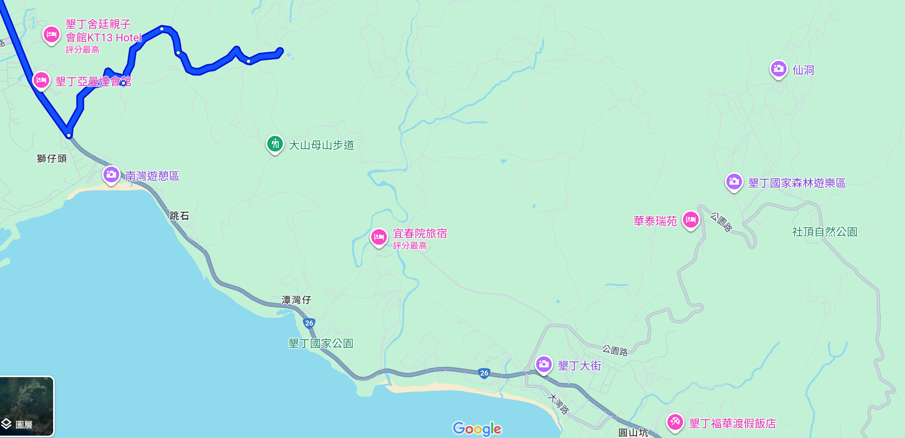

## 屏東6座小百岳
- https://travel.yam.com/article/126059
- 尾寮山
- 笠頂山
- 棚集山
- 女仍山
- 里龍山
- 大山母山

####  尾寮山
- 尾寮山有著南部「百岳最佳練習場」的稱號；雖然尾寮山的山頂沒有展望，不過一路上刺激有趣的路段就已讓人印象深刻。
- 尾寮山登山步道路途較長、山徑陡峭，來回一趟大約需花8至10小時左右
####  笠頂山  86分
- 登上笠頂山山頂，視野遼闊、風光明媚，能將整個屏東盡收眼底，天氣好時甚至能遠眺高雄呢！
- 笠頂山步道的路徑平緩好走、平易近人，石階與泥土路交互混雜的山徑，讓人輕鬆親近自然的同時，又不失健行運動的樂趣
- 笠頂山山徑步道多元，光單單登笠頂山的路線就有4條、可以安排環狀上下山，若加上瑪家三兄妹縱走等路線，路線便會更加複雜；因此，起登前一定要先規劃好路線，才不會迷路喔！
- 最高海拔：659公尺
- 路徑長度：單程0.8公里
- 步行時間：約1小時（往返）
- 難度：低
- 小百岳編號：76
- 基點：笠頂山/659m/三等三角點編號：7109
####  棚集山  屏東縣來義鄉丹林村   74分
- 棚集山是屏東三大名山之一、山徑相當熱門，也是原住民族的傳統領域
- 一路上密集的涼棚是棚集山的最大特色，與其山名不謀而合，十分有趣。
- 棚集山步道前段平緩、一路腰繞而上，沿著緩坡上行走起來並不費力，且動植物生態豐富，是一處天然戶外的自然教室
- 山徑難度隨著高度而逐漸提升，後段的路徑逐漸陡峭，有些路段近90度、須拉繩攀爬而上
- 最高海拔：899公尺
- 路徑長度：7.5公里
- 步行時間：5小時
- 難度：低－中
- 小百岳編號：78
- 基點：1.棚集山/899m/三等三角點/編號：6646  2.棚集下山/850m/省政府圖根補點/編號：342
####  女仍山
####  里龍山 屏東縣獅子鄉
- 最高海拔：1062公尺
- 路徑長度：單程4公里
- 步行時間：約7.5小時
- 難度：中
- 小百岳編號：80
- 基點：里龍山/1062m/一等三角點

####  大山母山   2小時11分
- 住宿
  - 福蓉山海林車床天地
    - 車床天地特約棧點「福蓉山海林」車宿，會員收費四人450+100（雨棚）+100（假日）+100（冷暖氣充電）共750元
    - 這裡生態很豐富，而且在大山母山登山口旁邊，加上在南灣附近的制高點，夜景很漂亮
    - https://www.youtube.com/watch?v=LIw8IBsZd9g 
- 從車城吃進恆春鎮。老店綠豆蒜、老屋柴燒麻糬、手桿蛋酥餅、高人氣包子店
- 墾丁墾丁路263號2樓
- 離 墾丁大街 150 公尺
- 墾丁半島上的最高峰，山徑較為冷門、人煙稀少，但沿途景色亮麗，一邊步行、一邊欣賞海天一色的美景，適合喜歡獨享清幽的旅人們。
- 大山母山難度並不高、路徑清晰，步道高低起伏不大、平坦好走，一路被花草樹木包圍，體驗漫步於自然中的快樂
- 最高海拔：325公尺
- 路徑長度：約2.5公里
- 步行時間：約2小時
- 難度：低
- 小百岳編號：81
- 基點：1.大山母山/325m/一等三角點 2.大山母山/325m/一等衛星控制點3.土地調查局圖根點 4.山字水泥柱
- 登山口處約可停4輛車，步道全程和緩好走，路徑清楚，三角點有無敵展望和絕美海景，可以遠眺墾丁

